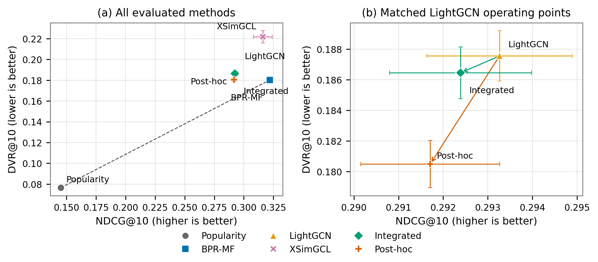
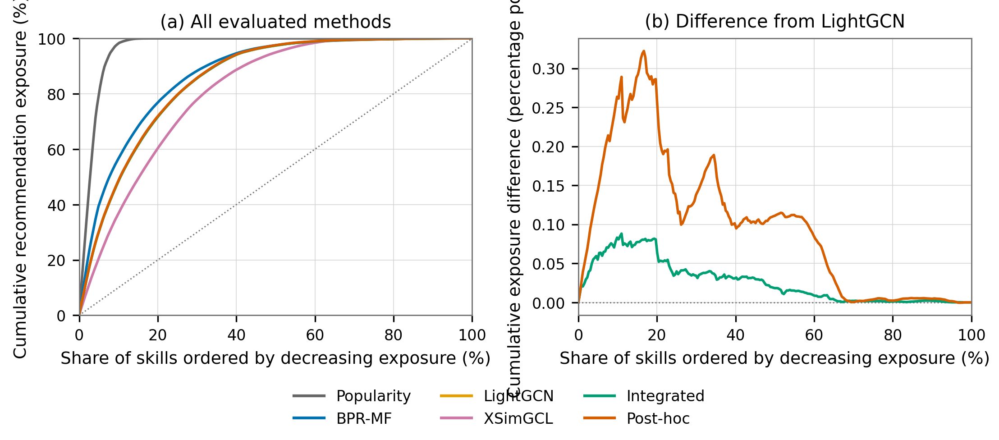

<!-- Generated by manuscript/build_full_manuscript.ps1. Edit source sections, not this file. -->
# Balancing Relevance and Overchallenge in Graph-Based Educational Recommendation: An Asymmetric Difficulty-Regularized LightGCN

> **Drafting note:** author names, affiliations, corresponding-author details, and acknowledgments remain to be supplied.

# Abstract

Top-K educational recommenders optimized only for interaction relevance may
expose learners to skills whose empirical difficulty substantially exceeds a
learner-specific reference point. This study investigates training-integrated
asymmetric difficulty regularization for LightGCN and compares it with matched
post-hoc reranking. Skill difficulty was estimated from first-exposure
correctness with empirical-Bayes smoothing, while learner ability was derived
from successfully encountered skills with population shrinkage. Both proxies
were computed strictly from the applicable temporal training prefix. A
one-sided squared excess risk was integrated into training as its expectation
under a temperature-controlled softmax over every unseen candidate, thereby
preserving a gradient path to the ranking scores. Evaluation used full ranking
over each learner's unseen candidates on a temporally split ASSISTments dataset
with 22,241 test
learners, 264 prefix-visible skills, and five matched seeds. Relative to
LightGCN, integrated regularization reduced DVR@10 by 0.001103, MED@10 by
0.000214, and squared risk@10 by 0.000051, while NDCG@10 and MRR@10 decreased
by 0.000874 and 0.001192; the paired Recall@10 interval included zero. Post-hoc
reranking was more conservative than integrated regularization, reducing
DVR@10 by a further 0.005960, but it also reduced Recall@10 by 0.002392 and
NDCG@10 by 0.000679. Validation-only sensitivity analyses showed that stronger
difficulty-control coefficients reduced overchallenge at a relevance cost and
that larger tolerance increased both relevance and fixed-threshold risk. These
results demonstrate distinct operating points on a relevance–overchallenge
frontier rather than universal dominance by either control strategy. The
findings characterize offline recommendation exposure under cohort-dependent
behavioral proxies and do not establish causal learning benefits.

**Keywords:** educational recommendation; graph collaborative filtering;
LightGCN; empirical difficulty; overchallenge regularization

# Introduction

Educational recommenders can help learners navigate a large set of available
resources, but relevance and pedagogical suitability are not necessarily the
same objective. In an implicit-feedback setting, an observed interaction may
indicate that content was assigned or encountered rather than preferred, and an
unobserved interaction does not establish dislike or inability. A model trained
only to recover future interactions can therefore rank content that is
behaviorally relevant while remaining silent about whether its empirical
difficulty substantially exceeds a learner-specific reference point.

Graph collaborative filtering provides a natural representation for this
setting. LightGCN simplifies graph recommendation to normalized neighborhood
aggregation over a user–item interaction graph and is commonly optimized with
pairwise ranking loss
([He et al., 2020](https://doi.org/10.1145/3397271.3401063)). Educational graph
models have also incorporated richer relations for knowledge-concept
recommendation, as in ACKRec
([Gong et al., 2020](https://doi.org/10.1145/3397271.3401057)). These lines of
work establish graph-based relevance modeling, but their cited formulations do
not directly control learner-specific overchallenge in the exposure induced by
a Top-K ranking.

Difficulty-aware recommendation is not new. For example, Zhang et al. model
difficulty within hierarchical reinforcement learning for sequential
learning-path generation
([2024](https://doi.org/10.1145/3637528.3671947)). That setting differs from
ranking the complete unseen catalog of skills from a collaborative-exposure
graph: a path policy selects successive learning and practice actions and is
evaluated in a simulated environment, whereas a Top-K recommender produces a
single ranked set. The distinction motivates a narrower question: can
learner-specific difficulty risk be incorporated into graph collaborative
filtering itself, and how does doing so compare with modifying scores only after
training?

We study next-new-skill recommendation using a temporally split ASSISTments
interaction dataset. Exposure defines the learner–skill graph, while
correctness is used separately to construct behavioral proxies. Skill
difficulty is estimated from first-exposure success rates using empirical-Bayes
smoothing. Learner ability is summarized from successfully encountered skills
and shrunk toward the population center. Both quantities are calculated only
from the applicable training prefix. For learner \(u\) and skill \(i\), we
define a one-sided squared risk that is positive only when empirical difficulty
exceeds estimated ability plus tolerance. This quantity characterizes
overchallenge exposure; it is not an intrinsic difficulty label or a measure of
learning benefit.

A fixed sum of such risks would provide no gradient to a recommender because
the proxy values do not depend on model parameters. We instead take their
expectation under a temperature-controlled softmax over the model scores of all
unseen candidates and add that expectation to the LightGCN training objective.
This candidate-aware construction creates a gradient path from overchallenge
risk to the ranking scores. We compare the integrated formulation with standard
LightGCN, conventional and modern relevance baselines, and a matched post-hoc
method that subtracts the same asymmetric risk from trained LightGCN scores.

This study addresses the following research questions:

- **RQ1:** How does training-integrated asymmetric difficulty regularization
  affect Top-K ranking accuracy and learner-specific overchallenge exposure
  relative to relevance-only LightGCN?
- **RQ2:** How does integrated regularization compare with matched post-hoc
  reranking in the relevance–overchallenge trade-off?
- **RQ3:** How sensitive is that trade-off to the regularization weight
  \(\lambda_d\) and tolerance \(\tau\)?

The contributions are threefold:

1. We formulate a differentiable, candidate-aware asymmetric overchallenge
   objective for LightGCN. It penalizes only exposure above an estimated
   learner-ability-plus-tolerance boundary and retains the standard model
   exactly when \(\lambda_d=0\).
2. We provide a controlled comparison between training integration and
   score-level post-hoc reranking using the same empirical risk, backbone,
   temporal split, full candidate sets, evaluation metrics, tuning discipline,
   and matched seeds.
3. We characterize the relevance–risk frontier using ranking metrics together
   with violation rate, mean excess difficulty, and squared exposure risk, and
   examine coefficient, tolerance, and risk-form sensitivity under a
   leakage-controlled protocol.

The empirical results show a trade-off rather than universal dominance.
Integrated regularization produced a small reduction in overchallenge exposure
relative to LightGCN, accompanied by small ranking concessions, while post-hoc
reranking achieved a larger risk reduction at a larger Recall/NDCG cost than
the integrated model. These findings concern offline recommendation exposure
under cohort-dependent behavioral proxies. They do not establish improved
learning outcomes, a causal educational benefit, or learning-path quality.

# Related Work

## Collaborative filtering and graph recommendation

Bayesian Personalized Ranking (BPR) formalized personalized ranking from
implicit feedback as pairwise optimization over observed and unobserved items
([Rendle et al., 2009](https://auai.org/uai2009/papers/UAI2009_0139_48141db02b9f0b02bc7158819ebfa2c7.pdf)).
Its treatment of unobserved interactions as ranking samples rather than explicit
negative ratings is relevant to educational exposure logs, where absence of an
interaction does not establish dislike or inability. We use BPR both as the
matrix-factorization baseline and as the relevance component of the graph
models.

LightGCN removes feature transformations and nonlinear activations from graph
collaborative filtering, retaining normalized neighborhood aggregation and a
weighted combination of layer-wise embeddings
([He et al., 2020](https://doi.org/10.1145/3397271.3401063)). Its deliberately
simple propagation makes it a useful backbone for isolating the effect of an
additional educational objective. More recent graph contrastive recommenders
seek stronger representations through self-supervision. XSimGCL uses
noise-based embedding augmentation and cross-layer contrast while sharing the
recommendation and contrastive propagation pipeline
([Yu et al., 2023](https://doi.org/10.1109/TKDE.2023.3288135)). We include it as
a modern graph baseline to distinguish gains from difficulty-aware control from
gains obtainable through a stronger relevance-only graph model.

These methods optimize general implicit-feedback ranking. They do not, in their
cited formulations, represent learner ability and empirical skill difficulty as
an asymmetric Top-K exposure cost. Our work retains their collaborative-ranking
foundation but adds a candidate-aware expected-risk term to the LightGCN
training objective.

## Graph and learner-state modeling in education

Educational recommendation research has used graphs to incorporate entities and
relations beyond a homogeneous learner–item interaction matrix. ACKRec constructs
a heterogeneous information network of learners, knowledge concepts, courses,
videos, and teachers, then uses meta-path-guided graph convolution and attention
for MOOC knowledge-concept recommendation
([Gong et al., 2020](https://doi.org/10.1145/3397271.3401057)). This demonstrates
that graph representation learning can support educational recommendation, but
its emphasis is interest/context propagation across heterogeneous relations.
The present study instead deliberately uses a minimal binary learner–skill graph
to isolate an overchallenge term in the ranking objective.

Learner-state models address a related but different problem. EKT combines
exercise content with recurrent representations of knowledge acquisition to
predict student performance on future exercises
([Liu et al., 2021](https://doi.org/10.1109/TKDE.2019.2924374)). Such prediction models
can provide rich estimates of learner state, whereas our ability variable is a
transparent, prefix-only behavioral proxy. However, predicting correctness for
a supplied exercise is not equivalent to ranking the complete unseen catalog,
and predictive accuracy alone does not characterize which difficulty levels a
Top-K recommender exposes.

## Difficulty-aware educational recommendation

Difficulty has been modeled explicitly in learning-path recommendation. The
closest verified anchor is the Difficulty-constrained Learning Path
Recommendation framework of Zhang et al.
([2024](https://doi.org/10.1145/3637528.3671947)). That work separates learning
and practice items, constructs a hierarchical graph, and applies
difficulty-driven hierarchical reinforcement learning to generate paths
step-by-step. Its experiments use simulators based on benchmark datasets and
evaluate path efficiency and smoothness.

Our setting differs along four dimensions. First, the output is a Top-10 list of
next-unseen skills rather than a sequential path containing learning and practice
actions. Second, the model is trained from a binary collaborative-exposure graph
rather than through a hierarchical reinforcement-learning environment. Third,
difficulty control is a soft asymmetric expected-exposure regularizer over the
full candidate catalog. Fourth, evaluation reports conventional ranking
relevance together with learner-specific overchallenge exposure and compares
training integration against score-level reranking. These distinctions prevent
claims about learning-path quality or simulated learning effectiveness from
being transferred to our offline Top-K task.

## Positioning of this study

Prior work establishes pairwise implicit-feedback ranking, simplified graph
collaborative filtering, contrastive graph representation learning, educational
knowledge-concept recommendation, learner-state prediction, and difficulty-aware
sequential path generation. The contribution examined here is narrower than
“difficulty-aware recommendation” in general: an empirical, learner-specific,
one-sided overchallenge risk is integrated into the LightGCN training objective
through the model-induced distribution over unseen candidates. A matched
post-hoc comparator then tests whether changing the training objective occupies
a different relevance–risk point from changing scores after training.

This positioning is a combination claim, not a priority claim. The targeted
primary-source comparison did not identify an identical task–objective–evaluation
combination, but it is not sufficient to establish that no such work exists. A
broader database search and reconciliation with the author's systematic review
remain necessary before submission.

# Method and Experimental Setup

## Problem formulation

We formulate the task as Top-K recommendation of the next newly encountered
skill. Let \(\mathcal{U}\) denote learners and \(\mathcal{I}\) denote skills.
An edge \((u,i)\) indicates that learner \(u\) was exposed to skill \(i\) in the
training prefix. The edge is an exposure signal rather than a claim that the
learner preferred or mastered the skill. Correctness is retained separately for
constructing empirical difficulty and learner-ability proxies.

For learner \(u\), the candidate set is

\[
\mathcal{C}_u = \mathcal{I}_{\mathrm{prefix}} \setminus
\mathcal{I}^{\mathrm{seen}}_u,
\]

where \(\mathcal{I}_{\mathrm{prefix}}\) contains only skills visible in the
corresponding training prefix. Models rank every member of \(\mathcal{C}_u\);
no sampled negatives are used during evaluation. The target is the learner's
next first exposure to a skill.

## Temporal data construction

We used the ASSISTments 2012--2013 School Data with Affect, distributed by the
official ASSISTments data site and obtained through the Kaggle mirror record
*ASSISTments Data Set 2012-2013* (version 4; records reverified on August 28,
2026; ASSISTmentsData, n.d.; Wattiez, 2021). The mirror's sole version-4 file is
`2012-2013-data-with-predictions-4-final.csv`; the analyzed local copy was named
`dataset_skill.csv`. The public file metadata and local copy have the same exact
size of 3,009,494,391 bytes.
The local input is additionally fixed by SHA-256
`1d06aee9e649c5ba9db49052fe9a86e68d0c3ccb4709a7487289d7721f5464db`.
Because the public mirror does not expose a cryptographic checksum, the public
record-to-local-copy match is supported by the variant description, sole-file
metadata, exact byte size, compatible schema, and local row audit, whereas the SHA-256
identifies the exact bytes used in this study. We cite Feng et al. (2009), as
requested by the official data page for uses that do not analyze the affect
columns.

We retained events with valid learner, skill, event, and timestamp fields;
numeric correctness in \([0,1]\); `original = 1`; and a problem type other than
open response. A value of `correct = 1` was treated as success, while values
below 1 were treated as non-success. Learners required at least three distinct
skills.

Events were ordered within learner by timestamp and event identifier. We then
identified the first exposure to every learner–skill pair. The penultimate first
skill exposure was held out as the validation target, and the last first skill
exposure was held out as the test target. Event-level temporal cutoffs were
applied before constructing graphs, catalogs, popularity, difficulty, ability,
or any other aggregate. Consequently, the development prefix ended before the
validation target, whereas the final prefix included the development data and
validation-period information but ended before the test target.

The development artifacts contained 22,241 learners, 262 skills, 2,132,943
events, and 320,119 unique learner–skill edges. Validation contained 22,239
evaluable targets and two skills that were globally invisible in the development
prefix. The final-training artifacts contained 22,241 learners, 264 skills,
2,297,527 events, and 342,360 unique learner–skill edges. All 22,241 test targets
were evaluable. Table 1 summarizes the model-facing data.

**Table 1. Model-facing temporal-split statistics.**

| Statistic | Development/validation | Final training/test |
|---|---:|---:|
| Learners | 22,241 | 22,241 |
| Prefix-visible skills | 262 | 264 |
| Prefix events | 2,132,943 | 2,297,527 |
| Unique learner–skill edges | 320,119 | 342,360 |
| Evaluable targets | 22,239 | 22,241 |
| Globally prefix-invisible targets | 2 | 0 |
| Mean unseen candidates | 247.607 | 248.607 |

The original complete 12-file Stage 1 handoff manifest was unavailable in the
received archive. Before test access, we therefore froze and reverified the full
set of byte hashes recorded by the structural audit. This controls subsequent
artifact drift but cannot establish equality to the missing original handoff
manifest.

## Recommendation models

### Baselines

Popularity ranks unseen skills by learner support in the current training graph,
with lexical skill identifier as the deterministic tie-breaker. BPR-MF learns
learner and skill embeddings from observed learner–skill exposure pairs using a
pairwise ranking loss. An unobserved skill sampled for optimization is not
interpreted as an explicit negative preference.

LightGCN propagates learner and skill embeddings over the normalized bipartite
exposure graph without feature transformations or nonlinear activations. With
initial embedding matrix \(\mathbf{E}^{(0)}\), propagation is

\[
\mathbf{E}^{(\ell+1)}=\tilde{\mathbf{A}}\mathbf{E}^{(\ell)},
\]

and the final representation averages the layer-wise embeddings. The ranking
score is the inner product \(y_{ui}=\mathbf{e}_u^\top\mathbf{e}_i\). Training
uses Bayesian Personalized Ranking,

\[
\mathcal{L}_{\mathrm{BPR}}=-\mathbb{E}_{(u,i,j)}
\log \sigma(y_{ui}-y_{uj}),
\]

where \(i\) is an observed exposure and \(j\) is sampled from the learner's
unseen prefix catalog.

XSimGCL serves as the modern graph baseline. It retains the LightGCN graph
backbone and adds noise-based contrastive views and an InfoNCE term. This
baseline tests whether a stronger graph representation alone improves the
relevance–risk profile without an explicit difficulty objective.

### Empirical skill difficulty

Difficulty is estimated strictly from first learner–skill exposures in the
applicable training prefix. For skill \(i\), let \(n_i\) be the number of first
exposures and \(c_i\) the number that were successful. A Beta prior is fitted to
the collection of skill-level binomial observations by empirical Bayes. The
smoothed success probability and behavioral difficulty proxy are

\[
p_i=\frac{c_i+\alpha}{n_i+\alpha+\beta},\qquad d_i=1-p_i.
\]

Using first exposures aligns the proxy with recommending a newly encountered
skill and prevents repeated practice from dominating the estimate. The quantity
\(d_i\) is cohort-dependent empirical difficulty, not intrinsic or ground-truth
difficulty.

### Learner ability proxy

Let \(\mathcal{S}_u\) be the unique prefix skills on which learner \(u\) had at
least one successful event, and let \(m_u=|\mathcal{S}_u|\). Raw ability is the
equally weighted mean difficulty of these skills,

\[
\bar a_u=\frac{1}{m_u}\sum_{i\in\mathcal{S}_u}d_i.
\]

To stabilize short histories, we use method-of-moments shrinkage toward the
population mean \(\mu\):

\[
a_u=\frac{m_u\bar a_u+\kappa\mu}{m_u+\kappa}.
\]

Learners without a successful prefix skill receive the population center. The
development audit estimated \(\alpha=3.7440\), \(\beta=2.6928\),
\(\mu=0.3591\), and \(\kappa=15.4729\); 620 development learners used the
population fallback. For final training, the same estimation procedure—not the
development parameter values—was applied to the final prefix.

### Asymmetric overchallenge risk

For tolerance \(\tau\), the learner–skill risk is

\[
r_{ui}=\left[\max(0,d_i-a_u-\tau)\right]^2.
\]

The penalty is zero for a skill at or below the learner's estimated ability plus
tolerance. Easier skills are not penalized symmetrically because the construct
of interest is overchallenge rather than absolute difficulty mismatch.

### Training-integrated regularization

A direct sum of fixed \(r_{ui}\) values would have zero gradient with respect to
the recommender parameters. We instead define a temperature-controlled
distribution over every unseen candidate:

\[
q_\Theta(i\mid u,\mathcal{C}_u)=
\frac{\exp(y_{ui}/T)}{\sum_{j\in\mathcal{C}_u}\exp(y_{uj}/T)}.
\]

The expected overchallenge exposure is

\[
\mathcal{L}_{\mathrm{over}}=
\frac{1}{|\mathcal{U}|}\sum_{u\in\mathcal{U}}
\sum_{i\in\mathcal{C}_u}q_\Theta(i\mid u,\mathcal{C}_u)r_{ui},
\]

and the complete objective is

\[
\mathcal{L}=\mathcal{L}_{\mathrm{BPR}}+
\lambda_d\mathcal{L}_{\mathrm{over}}+
\lambda_2\|\Theta\|_2^2.
\]

The expectation is computed exactly over the full unseen prefix catalog and is
averaged uniformly over learners at every optimizer step. This prevents the
pedagogical term from inheriting the degree-biased learner distribution of BPR
triples. Automatic-differentiation and synthetic gradient checks verified a
non-zero gradient path through the candidate softmax. Setting \(\lambda_d=0\)
skips the risk computation and produced a checkpoint bit-identical to the
selected LightGCN implementation.

### Post-hoc comparator

The post-hoc method leaves the trained LightGCN embeddings unchanged and adjusts
only ranking scores:

\[
y'_{ui}=y_{ui}-\gamma r_{ui}.
\]

It therefore provides a matched comparison between difficulty control during
optimization and difficulty control applied after relevance-only training.

## Evaluation metrics

Ranking relevance is measured using Recall@10, NDCG@10, and MRR@10. Globally
prefix-invisible targets are counted and excluded from relevance denominators.
For the Top-10 list \(R_u\), the Difficulty Violation Rate is

\[
\mathrm{DVR@10}=\frac{1}{10|\mathcal{U}|}
\sum_u\sum_{i\in R_u}\mathbb{1}[d_i>a_u+\tau].
\]

Mean Excess Difficulty is the unconditional mean positive excess over all
recommendation exposures,

\[
\mathrm{MED@10}=\frac{1}{10|\mathcal{U}|}
\sum_u\sum_{i\in R_u}\max(0,d_i-a_u-\tau),
\]

and squared risk@10 replaces the final excess with its square. We additionally
retain the full vector of item exposure counts in lexical skill order. All
metrics use full ranking over the same unseen candidate sets.

## Experimental protocol

All selection was performed on validation data. Popularity was deterministic.
BPR-MF, LightGCN, and XSimGCL each received a bounded four-configuration tuning
budget. The selected BPR-MF used 64-dimensional embeddings, learning rate 0.02,
and L2 weight 0.001. The selected LightGCN used one propagation layer,
64-dimensional embeddings, learning rate 0.005, L2 weight 0.0001, batch size
65,536, and five optimizer steps per epoch. XSimGCL used two layers,
contrastive layer 1, learning rate 0.002, contrastive weight 0.2, perturbation
magnitude 0.2, temperature 0.2, and the same LightGCN batch and L2 settings.

Integrated and post-hoc coefficient selection used four predeclared settings per
family. Candidate points were first restricted to the NDCG–DVR Pareto set. The
primary rule then selected the minimum DVR among configurations whose relative
NDCG loss from relevance-only LightGCN did not exceed 1%. This selected
\(\lambda_d=0.03\) for integrated training and \(\gamma=5\) for post-hoc
reranking. Both used \(\tau=0.1\); integrated training used \(T=0.2\).

Development runs used validation NDCG@10 for checkpointing under a frozen
100-epoch cap. Selected configurations were evaluated with seeds 20260827–
20260831. Sensitivity analyses varied \(\tau\in\{0,0.05,0.1,0.2\}\); the
integrated coefficient over \(\{0.03,0.1,0.3,1.0\}\); and the post-hoc
coefficient over \(\{1,5,10,20\}\). Risk-form ablations compared
asymmetric-linear and symmetric-squared objectives with target-free mean-risk
scale matching. None of these analyses could revise the selected settings.

For the final experiment, every stochastic method was retrained on the final
prefix for exactly 100 epochs without validation evaluation, early stopping, or
checkpoint selection. The same five seeds were used. Post-hoc reranking reused
the same-seed final LightGCN checkpoint, and a duplicate \(\lambda_d=0\) final
run was omitted because equivalence had already been verified. All 20 training
checkpoints and hashes were completed before a single guarded batch evaluation
opened the test targets. Test results were locked against rerunning or
reselection.

We report mean and sample standard deviation across five seeds. Primary
comparisons use matched-seed mean differences and two-sided 95% paired-t
confidence intervals. The intervals are interpreted together with effect
magnitudes and trade-offs rather than as standalone evidence of practical
importance. All experiments ran deterministically on CPU with fixed software
versions recorded in each run artifact.

## Computational considerations

For this dataset, exact candidate-aware regularization was feasible because the
catalog contained only 262 development skills and 264 final skills. LightGCN
propagation scales with the graph edges and embedding dimension. The additional
integrated term materializes learner–candidate scores and risks, adding an
approximately \(O(|\mathcal{U}||\mathcal{I}|d)\) score computation per optimizer
step and \(O(|\mathcal{U}||\mathcal{I}|)\) risk/softmax storage. This exact
implementation avoids candidate-sampling bias, but its cost would require
approximation for substantially larger catalogs.

# Results

## Final test performance

Table 2 reports the locked test results. All stochastic methods were trained with
five matched random seeds and are reported as mean ± sample standard deviation.
Popularity is deterministic and was evaluated once. The final evaluation
included 22,241 learners, no globally prefix-invisible test targets, 264 candidate
skills, and an average of 248.61 unseen candidates per learner.

**Table 2. Final Top-10 relevance and overchallenge results.**

_Reproducibility source: `manuscript/generated/RESULTS_TABLES.md`, generated
directly from the locked final summary._

| Method | Recall@10 | NDCG@10 | MRR@10 | DVR@10 | MED@10 | Squared risk@10 |
|---|---:|---:|---:|---:|---:|---:|
| Popularity | 0.287847 | 0.145124 | 0.101892 | 0.076485 | 0.002479 | 0.000228 |
| BPR-MF | **0.543186 ± 0.000981** | **0.321878 ± 0.000825** | 0.254217 ± 0.000920 | 0.180145 ± 0.001170 | 0.014737 ± 0.000048 | 0.002077 ± 0.000021 |
| LightGCN | 0.497792 ± 0.004085 | 0.293262 ± 0.001625 | 0.230797 ± 0.001494 | 0.187554 ± 0.001649 | 0.015498 ± 0.000114 | 0.002171 ± 0.000021 |
| XSimGCL | 0.509590 ± 0.006555 | 0.316049 ± 0.007898 | **0.256290 ± 0.008427** | 0.221725 ± 0.005924 | 0.021326 ± 0.000748 | 0.003899 ± 0.000149 |
| Integrated asymmetric-squared | 0.497972 ± 0.003583 | 0.292389 ± 0.001591 | 0.229605 ± 0.001465 | 0.186450 ± 0.001694 | 0.015284 ± 0.000120 | 0.002120 ± 0.000022 |
| Post-hoc asymmetric-squared | 0.495580 ± 0.004100 | 0.291709 ± 0.001557 | 0.229462 ± 0.001360 | 0.180490 ± 0.001547 | 0.014018 ± 0.000086 | 0.001816 ± 0.000026 |

BPR-MF obtained the highest mean Recall@10 and NDCG@10. XSimGCL obtained the
highest mean MRR@10, but it also produced the highest overchallenge exposure
among the learned models. Popularity produced the lowest risk values overall,
but its substantially lower relevance shows that low overchallenge alone does
not constitute a competitive personalized recommendation result.

Figure 1 places the final method means on the NDCG@10–DVR@10 plane and enlarges
the three matched LightGCN operating points. The plot makes both comparisons
visible: the integrated and post-hoc variants move toward lower DVR than
LightGCN, while post-hoc makes the larger relevance concession. Across all
evaluated method means, Popularity and BPR-MF form the discrete nondominated
set on this plane; the difficulty-controlled LightGCN variants should therefore
not be described as globally Pareto-optimal final methods.

**Figure 1. Final NDCG@10–DVR@10 operating points.** Points show means and
sample-standard-deviation whiskers across five matched seeds; Popularity is
deterministic. The dashed connection marks discrete nondominated method means,
not an interpolation. Panel (b) enlarges the matched LightGCN family.

Figure 2 reports the predeclared exposure distribution as a descriptive
concentration view. It averages item-level exposure counts across matched seeds
before sorting skills by decreasing exposure within each method. The figure was
not used for model selection or for defining an additional test criterion.

**Figure 2. Concentration of Top-10 recommendation exposure across skills.**
Curves that rise more steeply allocate more recommendation exposure to a
smaller share of the 264-skill catalog. The dotted diagonal represents uniform
exposure. Panel (b) reports each difficulty-controlled variant minus LightGCN
at the same catalog share; positive values denote greater concentration.

## RQ1: Effect of integrated difficulty regularization

Compared with standard LightGCN, integrated asymmetric regularization reduced
DVR@10 by 0.001103 (95% CI [−0.001265, −0.000942]), MED@10 by 0.000214
([−0.000239, −0.000190]), and squared risk@10 by 0.0000510
([−0.0000591, −0.0000430]). This reduction was accompanied by decreases of
0.000874 in NDCG@10 ([−0.001289, −0.000459]) and 0.001192 in MRR@10
([−0.001781, −0.000604]). The Recall@10 difference was 0.000180
([−0.000530, 0.000889]), for which the paired interval included zero.

These results show that the training-integrated term affected the ranked
exposure distribution in the intended direction, but the effect was a modest
relevance–overchallenge trade-off rather than a simultaneous improvement in
both objectives.

## RQ2: Integrated regularization versus post-hoc reranking

Table 3 reports matched-seed differences for the two difficulty-control
strategies. Negative risk differences favor the post-hoc method, whereas
negative relevance differences indicate a loss relative to the integrated
model.

**Table 3. Paired post-hoc minus integrated differences on the final test set.**

_Reproducibility source: `manuscript/generated/RESULTS_TABLES.md`._

| Metric | Mean difference | 95% paired-t CI |
|---|---:|---:|
| Recall@10 | −0.002392 | [−0.003077, −0.001707] |
| NDCG@10 | −0.000679 | [−0.001085, −0.000274] |
| MRR@10 | −0.000143 | [−0.000719, 0.000433] |
| DVR@10 | −0.005960 | [−0.006391, −0.005529] |
| MED@10 | −0.001266 | [−0.001355, −0.001176] |
| Squared risk@10 | −0.000304 | [−0.000323, −0.000285] |

Post-hoc reranking was more conservative: it reduced each overchallenge metric
relative to the integrated method. The integrated method retained higher
Recall@10 and NDCG@10, while the paired MRR@10 interval included zero. Thus,
neither control strategy dominated the other. Post-hoc reranking occupied the
lower-risk point, whereas integrated regularization occupied the higher-relevance
point under the frozen coefficients.

## RQ3: Sensitivity to the regularization weight and tolerance

The coefficient and tolerance analyses used validation data only and did not
alter the final configuration. In the bounded single-seed coefficient analysis,
increasing the integrated weight from 0.03 to 1.0 decreased DVR@10 from
0.185306 to 0.170982, while NDCG@10 decreased from 0.284224 to 0.277656.
All four integrated settings were non-dominated on the NDCG–DVR plane. The
predeclared 1% relative-NDCG-loss guardrail selected λd=0.03. The analogous
post-hoc sweep showed the same monotonic pattern: increasing γ from 1 to 20
reduced DVR@10 from 0.185046 to 0.160370 and NDCG@10 from 0.285649 to
0.279204; γ=5 satisfied the frozen selection rule.

Tolerance sensitivity was evaluated across five seeds at τ ∈ {0, 0.05, 0.1,
0.2}. Under a common evaluation anchor of τeval=0.1, increasing the training
tolerance from 0 to 0.2 raised integrated NDCG@10 from 0.282073 to 0.285926
and DVR@10 from 0.180369 to 0.185206. For post-hoc reranking, NDCG@10 rose
from 0.281769 to 0.285678 and DVR@10 from 0.162182 to 0.183959. Therefore,
larger tolerance improved relevance while exposing learners to more items that
violated the common overchallenge threshold. Native-threshold risk decreased as
τ increased, but that trend is partly definitional because the violation
threshold itself becomes less strict.

## Risk-form ablations

Five-seed, scale-matched validation ablations further supported the trade-off
interpretation. Replacing the asymmetric-squared term with an asymmetric-linear
term reduced DVR@10 by 0.001168 and squared risk@10 by 0.0000183, but reduced
NDCG@10 by 0.000709 and MRR@10 by 0.000968. Conversely, the
symmetric-squared form increased NDCG@10 by 0.000349 and MRR@10 by 0.000438,
while increasing DVR@10 by 0.000221 and squared risk@10 by 0.00000489.
Recall@10 was not clearly separated in either comparison. These ablations do
not establish universal superiority of the asymmetric-squared form; rather,
they show that the selected one-sided formulation implements the intended
overchallenge construct at a distinct point on the relevance–risk trade-off.

## Summary of findings

Across the three research questions, difficulty-aware control consistently
changed exposure risk, but stronger risk reduction generally required a
relevance concession. Integrated regularization provided a small reduction in
overchallenge relative to LightGCN, while post-hoc reranking achieved a larger
risk reduction at a larger Recall/NDCG cost. The coefficient, tolerance, and
risk-form analyses all exhibited the same underlying trade-off. These offline
results characterize recommendation exposure under behavioral difficulty and
ability proxies; they do not demonstrate improved learning outcomes.

# Discussion and Limitations

## Interpreting the relevance–overchallenge trade-off

The central result is not that difficulty-aware control improves every metric.
Instead, both integrated regularization and post-hoc reranking moved the
recommendations toward lower overchallenge exposure while conceding some
ranking relevance. This pattern appeared in the final comparison, the
coefficient sweeps, the tolerance analysis, and the risk-form ablations. The
consistency across these analyses supports the interpretation that relevance
and learner-specific overchallenge are distinct objectives in this setting.

Integrated regularization produced a small but consistent reduction in DVR,
MED, and squared risk relative to relevance-only LightGCN. Its Recall difference
was not clearly separated from zero, whereas NDCG and MRR decreased. This is
compatible with the role of the proposed loss: it changes the score distribution
over all unseen candidates rather than imposing a hard Top-10 constraint. The
selected coefficient was also deliberately conservative because it was chosen
under a predeclared 1% validation NDCG-loss guardrail. These observations explain
the size and direction of the effect, but they do not establish that the
guardrail or coefficient is optimal for another educational context.

Post-hoc reranking reduced overchallenge more strongly than the integrated
method at the frozen operating points. Its intervention acts directly on the
scores used to form the final ranking, whereas the integrated objective shapes
a temperature-smoothed candidate distribution during optimization. The two
coefficients therefore operate on different numerical scales and should not be
compared by magnitude. The final evidence shows that post-hoc occupied the
lower-risk point and integrated regularization occupied the higher-Recall and
higher-NDCG point; it does not show universal superiority of either mechanism.

The distinction matters operationally. Post-hoc control can be adjusted without
retraining and may be preferable when exposure policy must be changed rapidly.
Integrated control is relevant when the scoring model itself should internalize
the risk signal or when downstream reranking is unavailable. In either case,
the operating point should be selected from an explicit relevance–risk frontier
rather than from relevance alone.

## Baseline behavior

BPR-MF achieved the highest mean Recall and NDCG, while XSimGCL achieved the
highest mean MRR. The graph models therefore did not uniformly outperform the
simpler factorization model. One plausible explanation is that the learner–skill
catalog is small and the binary exposure graph already provides sufficient
collaborative information for direct factorization. Another is that propagation
or contrastive learning may emphasize graph structure that is not aligned with
the next-new-skill target. These are hypotheses rather than tested mechanisms;
the current experiment cannot attribute BPR-MF's advantage to graph smoothing,
density, or any single architectural property.

XSimGCL's relevance profile also illustrates why a stronger relevance model is
not automatically a safer educational recommender. It produced the highest mean
MRR but also the highest DVR, MED, and squared risk among learned models. This
does not imply that contrastive learning intrinsically increases difficulty.
It shows only that the relevance-only XSimGCL configuration selected on
validation NDCG did not control the frozen overchallenge proxy.

Popularity produced the lowest risk values but substantially lower relevance.
Because it is non-personalized, this result should not be interpreted as a
desirable pedagogical solution. It is instead an extreme reference point showing
that reducing the reported risk metric without preserving learner-specific
ranking utility is insufficient.

## Validation-to-test behavior

The overall trade-off transferred from validation to test, but not every paired
relevance comparison remained identical. On validation, integrated and post-hoc
NDCG were not clearly separated; on the final test, integrated retained higher
NDCG. The final models were retrained on the longer final prefix, the catalog
expanded from 262 to 264 skills, and the unseen candidate distribution changed
slightly. These observed protocol differences may contribute to the change, but
the study was not designed to isolate which factor caused it. In accordance with
the frozen protocol, no setting was revised after observing test performance.

## Sensitivity and asymmetric design

The coefficient sweeps formed monotonic NDCG–DVR trade-offs: stronger integrated
or post-hoc penalties reduced violations while reducing NDCG. The tolerance
analysis revealed an important measurement issue. When each ranked list was
evaluated using its own tolerance, risk declined mechanically as tolerance
increased because the violation boundary was relaxed. Under the common
\(\tau_{eval}=0.1\) anchor, the direction reversed: larger training or reranking
tolerance improved relevance but increased exposure beyond the shared
overchallenge threshold. Reporting only native-tolerance risk would therefore
overstate the apparent safety improvement.

The risk-form ablations did not establish that asymmetric-squared risk dominates
all alternatives. The asymmetric-linear form was more conservative but lost
NDCG and MRR, whereas the symmetric-squared form slightly improved those
relevance metrics while increasing overchallenge. The selected asymmetric form
is justified primarily by construct alignment: the research question concerns
items above ability plus tolerance, not equal penalization of easier and harder
items. Squaring the excess concentrates the penalty on larger violations. The
empirical evidence should thus be presented as support for a chosen trade-off
and construct, not proof that this mathematical form is universally best.

## Threats to construct validity

Difficulty and ability are behavioral proxies. Skill difficulty is estimated
from first-exposure correctness within the observed cohort and may reflect prior
instruction, opportunity to learn, interface effects, guessing, or population
composition. It is neither an intrinsic property of a skill nor expert-validated
curriculum difficulty. Learner ability is derived from the difficulties of
skills with any successful prefix event and shrunk toward a population center.
It does not model knowledge state transitions, forgetting, prerequisite mastery,
or uncertainty at the individual prediction level.

The two proxies are related by construction because ability aggregates the same
cohort-based skill difficulties used in the risk function. Temporal isolation
prevents validation or test leakage, and shrinkage reduces instability, but
neither step removes this conceptual dependence. Future work should compare the
behavioral proxy with external assessments or independently estimated knowledge
states.

DVR measures whether an exposure crosses a threshold, MED measures the
unconditional positive excess, and squared risk emphasizes larger excesses.
These metrics characterize recommendation exposure; they do not measure whether
a learner attempted, completed, mastered, or benefited from a recommendation.
Accordingly, lower offline risk cannot be claimed to improve learning outcomes.

## Threats to internal validity

The split and all derived statistics were constructed temporally within the
training prefix. Incorrect responses were not converted into negative
preferences, and unobserved skills served only as optimization samples. These
choices reduce leakage and semantic mismatch, but binary exposure remains an
imperfect implicit-feedback signal: an observed skill may have been assigned by
the platform rather than chosen by the learner.

Hyperparameter budgets were bounded and frozen before observing the associated
validation results. Nevertheless, the search spaces are necessarily selective.
A larger or differently scaled search could yield other Pareto points. The
integrated and post-hoc methods received equal numbers of coefficient settings,
but exact equivalence of optimization opportunity is impossible because one
coefficient weights a training loss and the other modifies final scores.

All selected development configurations reached the frozen 100-epoch cap.
Extending the cap after observing this behavior was prohibited, and final models
were consequently trained for exactly 100 epochs without test-based checkpoint
selection. This protects the test protocol but leaves open whether a separately
predeclared larger training budget would change absolute performance.

## Threats to conclusion validity

Stochastic methods were evaluated with five matched seeds. We report sample
standard deviations and paired-t confidence intervals, emphasizing effect sizes
and directions. With only five pairs, interval estimates remain sensitive to
seed-level variation, especially for XSimGCL. Multiple metrics and comparisons
were examined without treating unadjusted intervals as a family-wise hypothesis
testing procedure. The intervals should therefore support estimation and
trade-off interpretation rather than binary declarations of significance.

Popularity was evaluated once because it is deterministic, so it has no
seed-based uncertainty estimate. In addition, model selection used NDCG and DVR;
the remaining metrics are complementary outcomes rather than independent
selection criteria.

## Threats to external validity

The study uses one ASSISTments dataset and a learner–skill recommendation unit.
The catalog is small enough to permit exact full ranking and an exact
learner-by-candidate expected-risk term. Results may differ for exercise-level
recommendation, larger catalogs, other educational platforms, different age
groups, or systems in which learners freely choose content. The method produces
a Top-K recommendation list, not a sequential learning path, prerequisite plan,
or curriculum policy.

The exact expected-risk implementation has learner-by-catalog
\(O(|\mathcal{U}||\mathcal{I}|)\) score storage and score-computation cost
proportional to learners, items, and embedding dimension. Candidate sampling or
other approximations would be needed at substantially larger scale, and those
approximations could change both the gradient and the resulting trade-off.

No subgroup claim is made for learner ability or interaction sparsity because a
subgroup protocol was not frozen before final test access. Similarly, this study
does not evaluate fairness across demographic groups, classroom deployment, or
causal effects on achievement.

## Reproducibility limitation

The current workspace contains verified raw-file identity information and a
complete pre-test snapshot of all 12 canonical artifact hashes. The public raw
record, official ASSISTments landing page, mirror version, file metadata, and
required ASSISTments citation were reverified after the experiments. The public
mirror's sole version-4 file has the same byte size as the analyzed local copy,
and the exact local bytes are fixed by SHA-256; however, the mirror does not
publish a checksum for direct cryptographic comparison. Separately, the
original complete Stage 1 handoff manifest remains unavailable. The recorded
pre-test hashes prevent subsequent artifact drift and all final files passed the
pre-test gate, but they do not reconstruct that missing original manifest.

## Practical implication

Educational recommendation should expose the relevance–risk frontier rather
than collapse both objectives into a single unqualified “best model.” In this
experiment, integrated regularization offered a modest reduction in
overchallenge with limited ranking changes, whereas post-hoc reranking enabled a
larger risk reduction with a larger relevance concession. The appropriate point
depends on the cost assigned to overchallenge relative to missed relevant
skills. Determining that cost requires educational and stakeholder evidence
beyond the offline interaction data used here.

# Conclusion

This study examined whether learner-specific overchallenge risk can be
integrated into LightGCN training for next-new-skill recommendation. The method
combines the standard pairwise relevance objective with the expected value of a
one-sided squared difficulty risk under the model-induced distribution over all
unseen candidates. Difficulty and ability are prefix-only behavioral proxies,
and the formulation reduces exactly to the selected relevance-only LightGCN
implementation when \(\lambda_d=0\).

For RQ1, integrated asymmetric regularization changed the final ranked exposure
in the intended direction: it produced modest reductions in DVR@10, MED@10, and
squared risk@10 relative to LightGCN. These reductions were accompanied by
lower NDCG@10 and MRR@10, while the paired Recall@10 interval included zero.
The result is therefore a relevance–overchallenge trade-off rather than a
simultaneous improvement across objectives.

For RQ2, post-hoc reranking occupied a more conservative operating point than
integrated regularization under the frozen coefficients. It reduced all three
overchallenge metrics more strongly, whereas the integrated method retained
higher Recall@10 and NDCG@10; their MRR@10 difference was not clearly
separated. Neither strategy dominated the other. Integrated regularization is a
mechanism for incorporating the risk signal into model training, while post-hoc
reranking offers stronger and more easily adjustable score-level control in
this experiment.

For RQ3, the validation-only analyses showed that stronger difficulty-control
coefficients generally traded relevance for lower exposure risk. Tolerance also
changed the operating point: under a fixed evaluation threshold, larger
tolerance retained more relevance but allowed more overchallenge exposure.
This fixed-anchor result is important because risk measured at each setting's
own tolerance decreases partly by definition as the threshold is relaxed. The
risk-form ablations likewise identified different trade-off points rather than
a universally superior penalty form.

Overall, the findings support reporting a relevance–risk frontier instead of a
single unqualified best recommender. They also show that a stronger relevance
model is not necessarily less challenging: BPR-MF achieved the highest mean
Recall@10 and NDCG@10, whereas XSimGCL achieved the highest mean MRR@10 but the
highest overchallenge exposure among the learned models. Model choice and
difficulty-control strength should therefore reflect an explicitly justified
cost of overchallenge rather than ranking accuracy alone.

The conclusions are limited to offline Top-K exposure on one temporally split
ASSISTments dataset and to cohort-dependent behavioral proxies. The results do
not establish intrinsic skill difficulty, learner mastery, improved learning
outcomes, causal educational benefit, or learning-path quality. Future work
should validate the proxies against independent learner-state or assessment
signals, test additional datasets and recommendation units, study scalable
approximations for larger catalogs, and evaluate operating-point choices with
educational stakeholders before prospective deployment.

# Data and Code Availability

The ASSISTments 2012--2013 data are publicly described and distributed through
the official ASSISTments data page, with a version-4 mirror record on Kaggle.
The raw and row-level processed data are not redistributed in this repository.
The exact local input used in the study is identified in the Method by filename,
byte size, and SHA-256 so that an independently obtained copy can be checked
against the analyzed bytes.

The implementation, frozen configurations, audit records, aggregate result
artifacts, manuscript sources, and deterministic figure-generation code are
available at
https://github.com/syamsudintekno/next_skill_recommender. An immutable archived
release identifier will be added before submission; until then, manuscript
claims are traceable to the Git commit reported with the submitted version.

# References

> **Drafting note:** entries below cover only works currently cited in the
> manuscript and use verified publication metadata. They must be converted to
> the final JOIN reference style.

ASSISTmentsData. (n.d.). *2012-13 School Data with Affect*. Retrieved August
28, 2026, from
https://sites.google.com/site/assistmentsdata/datasets/2012-13-school-data-with-affect

Feng, M., Heffernan, N., and Koedinger, K. (2009). Addressing the assessment
challenge with an online system that tutors as it assesses. *User Modeling and
User-Adapted Interaction, 19*(3), 243--266.
https://doi.org/10.1007/s11257-009-9063-7

Gong, J., Wang, S., Wang, J., Feng, W., Peng, H., Tang, J., and Yu, P. S.
(2020). Attentional Graph Convolutional Networks for Knowledge Concept
Recommendation in MOOCs in a Heterogeneous View. In *Proceedings of the 43rd
International ACM SIGIR Conference on Research and Development in Information
Retrieval*. https://doi.org/10.1145/3397271.3401057

He, X., Deng, K., Wang, X., Li, Y., Zhang, Y., and Wang, M. (2020). LightGCN:
Simplifying and Powering Graph Convolution Network for Recommendation. In
*Proceedings of the 43rd International ACM SIGIR Conference on Research and
Development in Information Retrieval*.
https://doi.org/10.1145/3397271.3401063

Liu, Q., Huang, Z., Yin, Y., Chen, E., Xiong, H., Su, Y., and Hu, G. (2021).
EKT: Exercise-Aware Knowledge Tracing for Student Performance Prediction.
*IEEE Transactions on Knowledge and Data Engineering, 33*(1), 100–115.
https://doi.org/10.1109/TKDE.2019.2924374

Rendle, S., Freudenthaler, C., Gantner, Z., and Schmidt-Thieme, L. (2009). BPR:
Bayesian Personalized Ranking from Implicit Feedback. In *Proceedings of the
Twenty-Fifth Conference on Uncertainty in Artificial Intelligence* (pp.
452–461). AUAI Press.
https://auai.org/uai2009/papers/UAI2009_0139_48141db02b9f0b02bc7158819ebfa2c7.pdf

Wattiez, N. (2021). *ASSISTments Data Set 2012-2013* (Version 4) [Data set].
Kaggle. Retrieved August 28, 2026, from
https://www.kaggle.com/datasets/nicolaswattiez/skillbuilder-data-2009-2010

Yu, J., Xia, X., Chen, T., Cui, L., Hung, N. Q. V., and Yin, H. (2023).
XSimGCL: Towards Extremely Simple Graph Contrastive Learning for
Recommendation. *IEEE Transactions on Knowledge and Data Engineering*.
https://doi.org/10.1109/TKDE.2023.3288135

Zhang, H., Shen, S., Xu, B., Huang, Z., Wu, J., Sha, J., and Wang, S. (2024).
Item-Difficulty-Aware Learning Path Recommendation: From a Real Walking
Perspective. In *Proceedings of the 30th ACM SIGKDD Conference on Knowledge
Discovery and Data Mining* (pp. 4167–4178).
https://doi.org/10.1145/3637528.3671947
